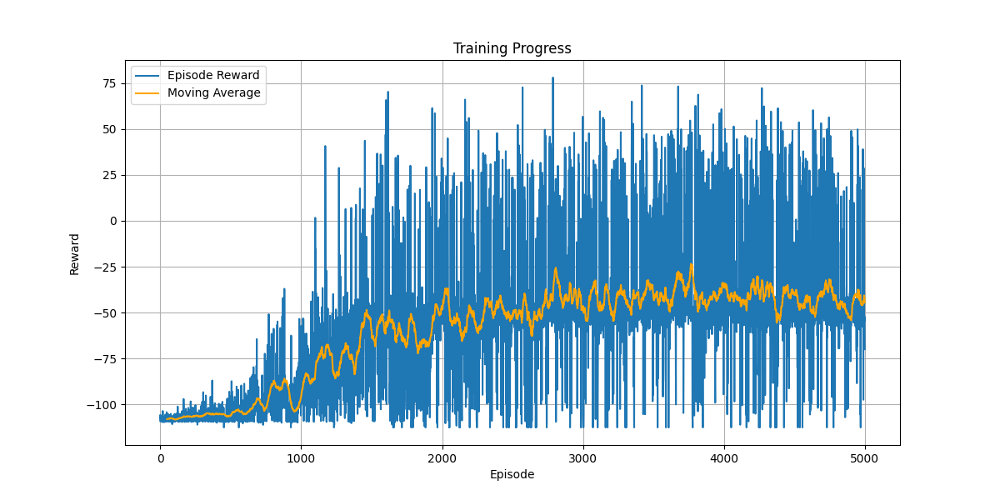

# Gymnasium Car Racing RL

Abgabe für Lernziel 3: Trainig eines klassischen RL Agenten (DQN / PPO) auf GYM oder anderen Environments

Martrikelnummer: 5709658

## Project Description

The goal of this project is to develop a reinforcement learning agent capable of driving a car on a randomly generated race track in the Gymnasium environment "[CarRacing-v2](https://gymnasium.farama.org/environments/box2d/car_racing/)". The task involves controlling a car to navigate the track efficiently while avoiding penalties for going off-track.

The observation space consists of a top-down 96x96 RGB image, representing the car's view of the race track. This image includes the car's position, orientation, and surrounding environment. The action space can be set to continuous or discrete with the latter compromising of the five actions: do nothing, steer left, steer right, gas and brake.

The agent's performance is evaluated based on a reward system that incentivizes staying on the track and penalizes going off-track or failing to maintain progress on the course.

At the beginning, the general functionalities of the environment were explored in this [notebook](reinforcement_learning/experiments/car_racing_exploration.ipynb). One of the main observations from these explorations is the fact that at the beginning of each run, there is a sequence of frames that zoom in on the car. As this sequence could make it harder for the agent to understand the observation, it was decided to wait for the first 50 frames of each run and not perform any action.
Other preprocessing steps include converting the input to grayscale, resizing it to 84x84 pixels, and using a frame stack of 4 to convey temporal changes.

From this preprocessing, an RL-Agent was trained using Deep Q Learning (DQN). The structure of the network can be found in [dqn.py](reinforcement_learning/src/dqn.py) and the main training is implemented in [main.py](reinforcement_learning/src/main.py). Some additional functions can be found in [utils.py](reinforcement_learning/src/utils.py).

After the first training runs, one critical adjustment was made to the reward function. Normally the agent receives rewards whenever it moves to new sections of the track. Especially at the beginning, one of the main issues was the fact that the agent just stood still and did not collect any rewards but instead received negative rewards for not moving. Since the environment takes significant time before a run is aborted, a new mechanism was added that incentivizes the agent to start collecting positive rewards.
A `negative_reward_counter` is introduced to monitor the agent's performance when it receives negative rewards. This counter increments when the agent's reward is negative after a certain number of initial steps. If the agent receives a positive reward or after resetting the run, the counter is reset to zero. If the `negative_reward_counter` exceeds a predefined threshold (in this case, 25 consecutive negative rewards), the episode is terminated early. This is a critical adjustment as it avoids wasting time on runs where the agent is stuck or consistently performing poorly.
When the threshold is exceeded, a large negative reward (-100) is assigned to the agent, penalizing the poor performance significantly. This encourages the agent to avoid such behavior in the future. It was discovered that this significantly helped speed up the training process and helped the agent understand the goal of driving on the track.

During training, a plot of both the current reward and the 50-step average reward is generated to track progress. The RL model can be saved at regular intervals, and video recording can also be enabled periodically. This setup allows for effective monitoring and exploration of the training process.

## Installation

### Prerequisites

- Python 3.10 installed.

### Setup

1. **Clone the repository:**

```bash
git clone https://github.com/benediktpri/car_racing_gym
cd car_racing_gym
```

2. **Create a virtual environment (optional but recommended):**

```bash
python3 -m venv venv
source venv/bin/activate  # On macOS/Linux
venv\Scripts\activate     # On Windows
```
3. **Install the dependencies:**
```bash
pip install -r requirements.txt
```

### Usage

To start the training, please run the file [main.py](reinforcement_learning/src/main.py). In the code, you can optionally adjust the training parameters such as the number of episodes or buffer size. The results of the training are saved in the models folder.

To view a run of a previously trained model, the file [evaluate.py](reinforcement_learning/src/evaluate.py) can be used. Here, the path to the desired model needs to be set.

## Training Results
While the training shows promising initial results and the car does learn to drive, it still lacks certain important capabilities. Most notably, although it reliably drives forward in a straight line, it does not make turns on time and therefore goes off track after a while.

One of the biggest challenges during the training was the limited computing capacity and the resulting long training times. This was slightly improved by moving the training to Kaggle, where the availability of more powerful GPUs improved the training speed, but it was still ultimately limited by the 12-hour training limit.

During the initial training on a local laptop, up to 1000 episodes were run. Some progress was observed, but the results did not meet expectations and took a long time. The training on Kaggle was then expanded to up to 5000 episodes, and the following plot shows the rewards during this training:



It can be seen that after minimal progress in the beginning, the agent begins to improve its rewards around the 1000th episode. The rewards then increase until around the 2000th episode. After this, only slight improvements are observed, and the rewards mostly oscillate slightly. Although there are episodes with a total positive reward, the moving average remains negative due to the significant penalties imposed by the previously described negative reward system.

While this plot provides a good initial impression of the training progress, a better understanding is possible by examining examples of the car's driving performance in different episodes. From another training run during which videos were recorded, three examples have been chosen to demonstrate the agent's progress.


https://github.com/user-attachments/assets/518eeb9f-d2ba-425e-8e2d-43f5188b25e7

Episode 350: The agent does not move yet and is not collecting rewards.

https://github.com/user-attachments/assets/7521c91a-19cb-45f5-aeee-e0e06fce0616

Episode 500: The agent has learned to drive forward; however, it is still rather slow and occasionally turns its wheels randomly.

https://github.com/user-attachments/assets/d14f8145-35f2-48ed-b148-d6127f211a24

Episode 950: The agent drives confidently and quickly forward. At the curve, the car does not turn and goes off track. 

There are several plausible improvements that can be made in the future. The duration of the training or the hardware used could be enhanced to allow the agent to learn that the car needs to turn at the curves. Further adjustments to the reward function could also be made. Lastly, it is possible to explore and compare the performance of other reinforcement learning methods besides DQN, or to rely on libraries such as Stable Baselines 3.
